#PSDM

Code for "A Progressive Semi-Distillation Model for Dual-source Remote Sensing Image Classification".


> Panchromatic images (PANs) and Multispectral images (MSs) are widely used for dual-source remote sensing image classification, gradually becoming a research hotspot. However, making the most of dual-source image information with insufficient labeled samples is a significant challenge. This paper proposes a Progressive Semi-Distillation Model (PSDM) for classifying dual-source remote sensing images with insufficient samples. We design a framework of ``Rookie Teacher Network (RTN)-Teaching Assistant System (TAS)-Student Grouping Network (SGN)" in the case of a traditional Teacher Network (TN) (i.e., RTN) that does not provide excellent guidance to Student Network (SN) due to insufficient samples. The PSDM expands the samples and compresses the space through the RTN-SGN structure to cope with the dilemma of insufficient samples. To make RTN better guide SGN, we design TAS, which can gradually guide SGN to learn samples from easy to difficult. It can also assist SGN training further to improve the classification performance of SGN with insufficient samples. We design SGN and add cooperation and correction mechanisms to learn dual-source information better. These strategies can eliminate SGN's over-dependence on the RTN, help SGN outperform the RTN, and achieve the effect of semi-distillation. Experimental results and theoretical analysis have sufficiently pointed out the proposed method's accuracy, efficiency, and robustness under insufficient sample situations. Our model is available at https://github.com/MarjordCpz/PSDM.

## Framework of PSDM



## Folder Description

PSDM is trained and tested on four datasets: Beijing, Shanghai, Hohhot and Nanjing.

Each folder in Code corresponds to a code for a regional dataset. The following descriptions will all be represented by one dataset.

`./Code` and `./Result` directory structure is shown below:

```

Code
├── Bei & Shang
│    ├── Beijing
│    │      ├──architecture.py------Network architectures in PSDM
│    │      ├──getDataset.py------Functions to obtain and process data
│    │      ├──TAS.py------Teaching assistant system structure
│    │      ├──train_SGN.py------Code for training SGN
│    │      ├──train_RTN.py------Code for training RTN
│    │      ├──index.py------Code for testing OA AA Kappa
│    │      └──color.py------Code for visualizing results
│    └── Shanghai
│            └──......
└── Hu & Nan
​     ├── Hohhot
​     └── Nanjing

Result
├── Beijing
├── Hohhot
├── Nanjing 
└── Shanghai
```

## Pre-training
Start by training the RTN and save the trained network parameters in the `pre trained models` folder.

This code ``` teacher_path= ".\pre trained models\teacher.pkl" ``` is the destination path.


## Training
Once the RTN is trained, you can start training the SGN.

The settings of the parameters are shown in the py file.

After the training is completed, the network parameter files are automatically saved in the 1 folder.

After the training is completed, the network parameter files are automatically saved in the `pre trained models` folder. And output the OA, AA and Kappa metrics of the two student networks
## Result
PSDM takes the best-performing student network as the final result, so we can get two sets of coloring maps and take the one with the best performance as our final result.